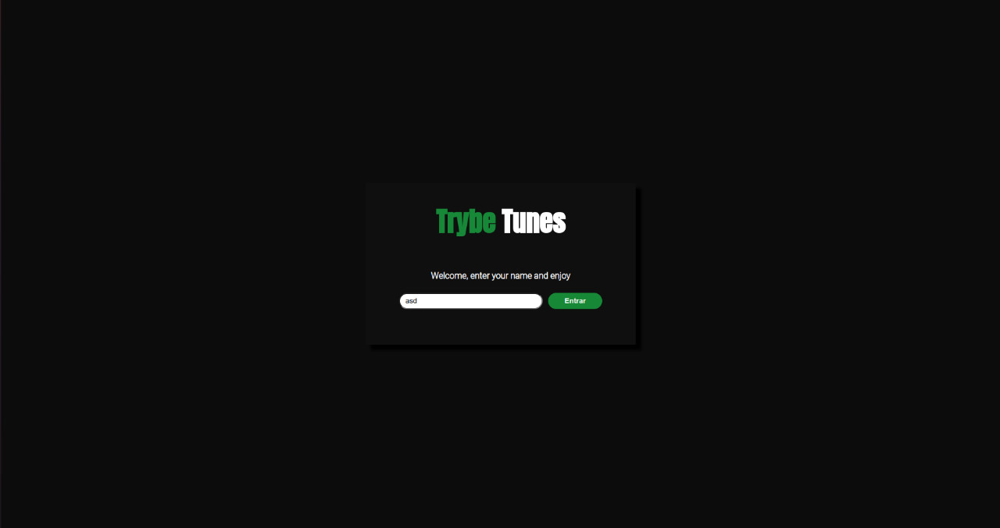
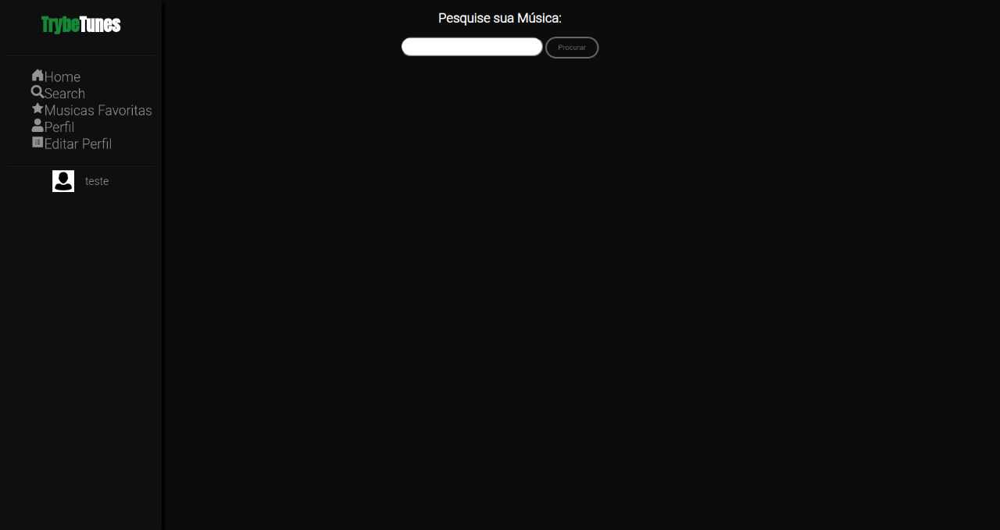
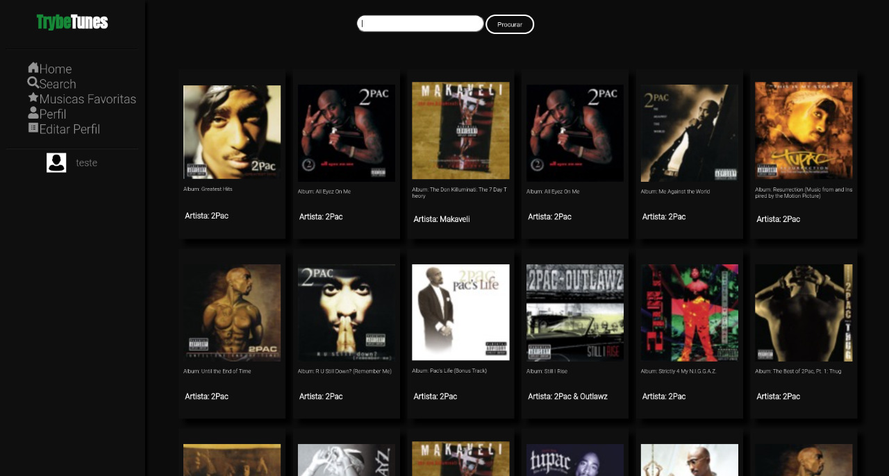

# Trybetunes

Neste aplicação você é capaz de reproduzir músicas das mais variadas bandas e artistas, criar uma lista de músicas favoritas e editar o perfil da pessoa usuária logada. Essa aplicação é capaz de:

- Fazer login;
- Pesquisar por uma banda ou artista;
- Listar os álbuns disponíveis dessa banda ou artista;
- Visualizar as músicas de um álbum selecionado;
- Reproduzir uma prévia das músicas deste álbum;
- Favoritar e desfavoritar músicas;
- Ver a lista de músicas favoritas;
- Ver o perfil da pessoa logada;
- Editar o perfil da pessoa logada;


## Habilidades desenvolvidas:

Nessa aplicação, foi:
- Feita requisições e consumido dados vindos de uma API;
- Utilizado os ciclos de vida de um componente React;
- Utilizado a função setState de forma a garantir que um determinado código só é executado após o estado ser atualizado
- Utilizado o componente BrowserRouter corretamente;
- Criado rotas, mapeando o caminho da URL com o componente correspondente, via Route;
- Utilizado o Switch do React Router
- Criado links de navegação na aplicação com o componente Link;

**OBS:** Algumas funções da pasta de services são criações da @Trybe.

## Tecnologias Utilizadas:
- Aplicação foi desenvolvida em **React** utlizando os **componentes** de **Classe**;
- Algumas coisas são passadas através da utilização do **Local Storage**;
- É utilizado um **Regex** para validação do email.

## Rode Localmente:

Clone o projeto

```bash
  git clone git@github.com:hgo19/trybetunes.git
```

Vá para o diretório do projeto

```bash
  cd trybetunes
```

Instale dependencias

```bash
  npm install
```

Inicie o servidor

```bash
  npm start
```

## Como funciona o projeto?

TrybeTunes é uma aplicação que logo na sua página inicial já solicita um 'nome' de usuário para entrar, qualquer nome é válido a partir que tenha 3 ou mais characters.
<details>
<summary><strong>Imagem tela de Login </strong></summary>


</details>
Após isso você é direcionado para uma tela em que pode fazer a sua primeira pesquisa de artista, música ou album. Assim conseguindo achar todos os albuns cadastrado na API do itunes relacionados a sua pesquisa.
<br />
<br />

<details>
<summary><strong>Imagem tela de Search </strong></summary>


</details>
<br />
<details>
<summary><strong>Exemplo tela de Search após pesquisa feita</strong></summary>


</details>
<br />

Além disso, a aplicação contém diversas outras opções, como entrar no album selecionado e escutar alguns segundos de alguma música que contenha nesse album. Favoritar e desfavoritar a musica que você mais gostar, e depois vê-las em suas 'Musicas Favoritas'.
<br />
A aplicação também disponibiliza a possibilidade de você editar o seu perfil para deixar a página ainda mais a sua cara. Enfim, para saber mais visite a aplicação.

<br />

### Link para a aplicação: 
 [TrybeTunes](https://hgo19.github.io/trybetunes/)
